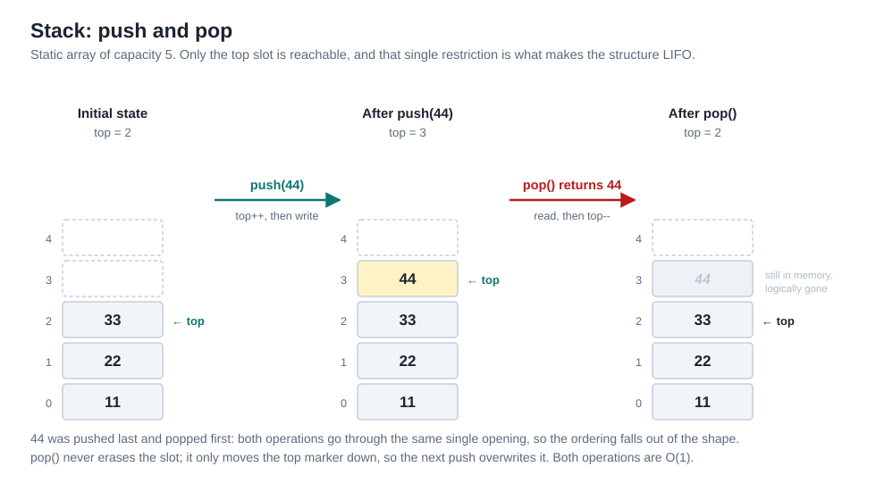
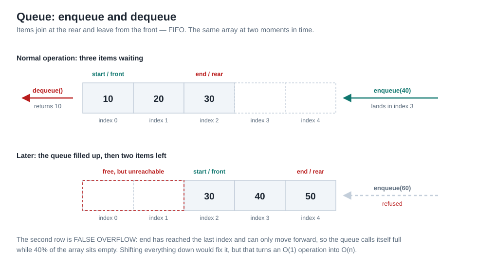
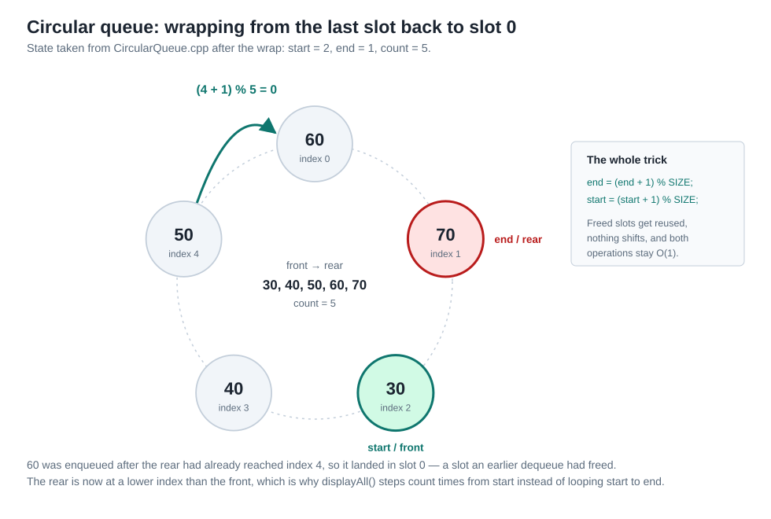
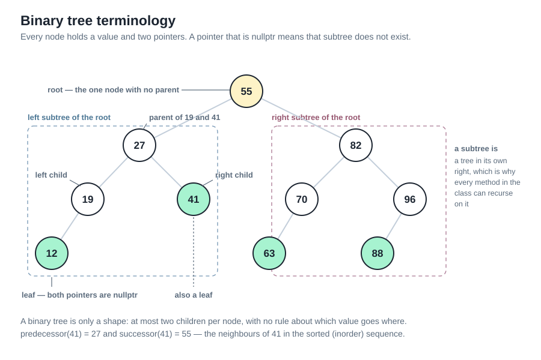
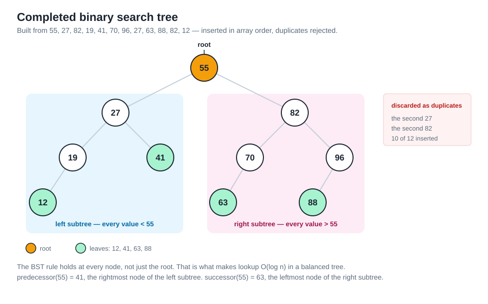
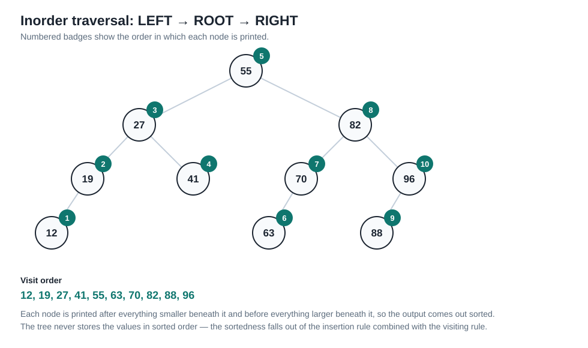
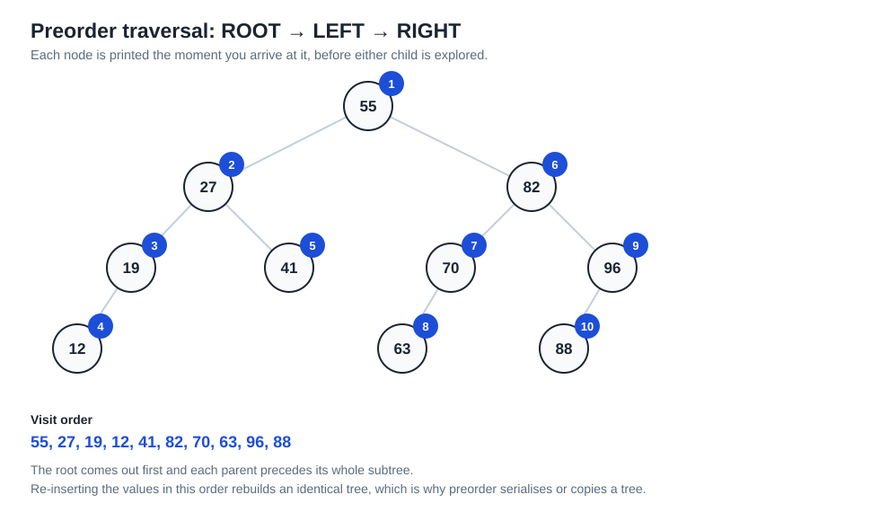
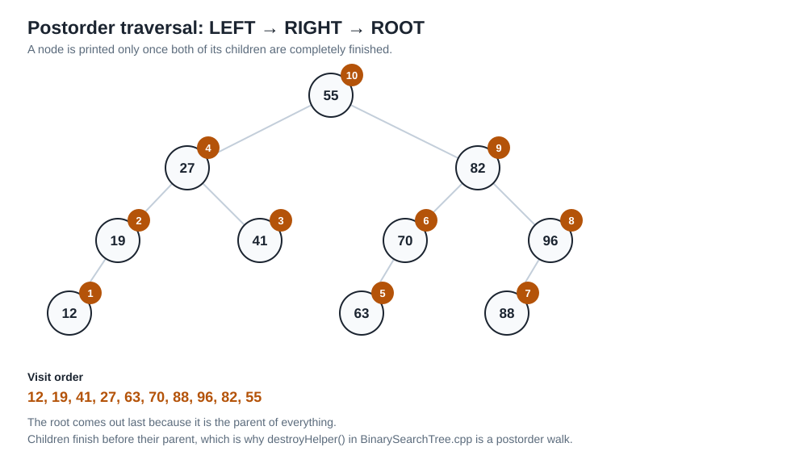

# BLA: Stacks, Queues, and Trees

**Name:** Pranav
**Course:** CSC-6021 Data Structures and Algorithms II
**Instructor:** Dr. Victor Govindaswamy

| Link | URL |
|---|---|
| GitHub | _(fill in)_ |
| YouTube | _(fill in)_ |
| LinkedIn | _(fill in)_ |

---

## Part 1 — Stack

A stack is a collection where you can only touch one end of it. New items go on top, and the only item you are allowed to remove is the one currently on top. That single restriction is the whole idea, and it gives the structure its name: **LIFO — Last In, First Out**.

### How it behaves

| Operation | What it does | Cost |
|---|---|---|
| `push(x)` | Puts `x` on top | O(1) |
| `pop()` | Removes and returns the top item | O(1) |
| `peek()` / `top()` | Reads the top item without removing it | O(1) |
| `isEmpty()` | True when nothing has been pushed, or everything has been popped | O(1) |
| `isFull()` | True when the fixed array has no free slot left | O(1) |
| `displayAll()` | Prints the contents, conventionally top to bottom | O(n) |

Every operation is constant time because nothing ever has to shift. Compare this to removing the first element of an array, where all the remaining elements slide down one position.

### Implementing it with a static array

The implementation needs only two things: an array of a fixed size, and one integer called `top` that holds the index of the most recently pushed element.

- `top = -1` means the stack is empty — there is no valid index to point at.
- `push` increments `top` first, then writes into `arr[top]`.
- `pop` reads `arr[top]`, then decrements `top`.

Notice that `pop` does not erase anything. The old value is still physically sitting in memory; it is simply no longer inside the region `arr[0] .. arr[top]`, so it is logically gone and the next `push` will overwrite it.

### Overflow and underflow

**Stack overflow** happens when `push` is called while `top == SIZE - 1`. Without a guard, the code would write to `arr[SIZE]`, which is one past the end of the array. In C++ that is undefined behaviour — it will not throw an error, it will silently corrupt whatever memory happens to be next. This is why `isFull()` is checked before every write.

**Stack underflow** happens when `pop` or `peek` is called on an empty stack. `arr[-1]` is a negative index, again out of bounds. The implementation checks `isEmpty()` first and returns a sentinel value rather than reading garbage.

### Advantages and limitations of an array-based stack

**Advantages**

- All memory is allocated once, so there is no `new`/`delete` and no risk of leaking.
- Elements sit in one contiguous block, which is cache friendly and fast to walk.
- The code is short and easy to reason about — no pointers to get wrong.

**Limitations**

- The capacity is fixed at compile time. Choose too small and you overflow with valid data; choose too large and you waste memory that stays reserved whether it is used or not.
- Growing means allocating a bigger array and copying everything across, which is O(n).
- A linked-list stack has no capacity ceiling, at the cost of one pointer per element and scattered memory.

### Layperson example — the tray stack in a cafeteria

Clean trays get put on a spring-loaded post. A worker brings out a fresh tray and sets it on top of the pile. When you come through the line, you take the tray off the top. You physically cannot take the bottom tray without lifting every tray above it first.

So the tray that was placed most recently is the one that leaves first. Not because of any rule anyone wrote down, but because of the **shape** of the thing — there is only one opening, and both adding and removing have to go through it. That is exactly why a stack is LIFO. Access is restricted to one end, so the ordering falls out of the geometry.



*Diagram 1 — the same three states the demo program prints, with the `top` index marked in each.*

---

## Part 2 — Queue and Circular Queue

A queue is the other natural restriction: items are added at one end and removed from the other. **FIFO — First In, First Out**. Whatever has been waiting longest is served next.

### Terminology

- **start / front** — index of the element that will leave next.
- **end / rear** — index of the element added most recently.
- `enqueue(x)` — add `x` at the rear.
- `dequeue()` — remove and return the element at the front.
- **Queue overflow** — enqueueing when every slot is occupied.
- **Queue underflow** — dequeueing when the queue is empty.

### The problem with a plain linear array queue

In a linear queue, `start` and `end` only ever move forward. Suppose the array holds 5 slots and you enqueue 5 items — `end` is now at index 4, the final index. Now dequeue twice. Indices 0 and 1 are free, but `end` has nowhere left to go, so the queue reports itself full and refuses new items.

This is called **false overflow**: the structure claims to be full while 40% of the array is sitting empty and unreachable. You could fix it by shifting every element down after each dequeue, but that turns an O(1) operation into O(n).

### How a circular queue fixes it

Treat the array as a ring rather than a line. The index after the last one is index 0 again. In code that is one modulo operation:

```cpp
end = (end + 1) % SIZE;     // enqueue
start = (start + 1) % SIZE; // dequeue
```

When `end` is 4 and `SIZE` is 5, `(4 + 1) % 5 == 0`, so the next item lands in slot 0 — the slot that was freed earlier. Nothing shifts, both operations stay O(1), and the freed space becomes reusable.

After a wrap the rear can be at a *lower* index than the front. This is why `displayAll()` cannot loop from `start` to `end`; it has to step `count` times from `start`, wrapping each step.

### Distinguishing full from empty

Using only `start` and `end`, the condition `start == end` is ambiguous — it is true both when the queue is completely empty and when it is completely full. There are two standard fixes: deliberately leave one slot unused, or keep a `count` of live elements. This implementation keeps a `count`, so all `SIZE` slots stay usable and `isEmpty()` / `isFull()` are trivially correct.

### Layperson example — one drive-through window

Cars pull up behind each other at a drive-through. The car at the window is served and leaves; the next car rolls forward. A car arriving now goes to the back, and there is no way to jump the line — order of arrival fully determines order of service.

The circular part maps onto a small parking lot with 5 numbered spaces used as the waiting area. Space 5 is the last one physically, but once space 1 empties out, the next arriving car parks there. The lot is used as a loop rather than a dead end, which is precisely what the modulo does.



*Diagram 2 — normal FIFO operation on top; the false-overflow state underneath.*



*Diagram 3 — the same five slots drawn as a ring, showing the moment `end` moves from index 4 to index 0.*

---

## Part 3 — Binary Trees and Binary Search Trees

### The difference

A **binary tree** is any tree where every node has at most two children. There is no rule about *which* value goes where — a binary tree is purely a shape.

A **binary search tree** is a binary tree plus an ordering invariant:

```
value < node  ->  LEFT subtree
value > node  ->  RIGHT subtree
```

That invariant must hold for *every* node, not just the root. It is what turns the shape into a searchable structure: at each node you compare once and discard an entire side of the tree. In a balanced BST that is O(log n) instead of the O(n) of a plain binary tree, where you would have to check every node because nothing tells you which way to go.

### Terminology

| Term | Meaning |
|---|---|
| **Node** | One element: a data value plus links to its children |
| **Root** | The single node with no parent; the entry point to the tree |
| **Parent** | A node that has a link pointing down to another node |
| **Child** | A node directly below and linked from a parent |
| **Left child** | The child reached through the `left` pointer (smaller value in a BST) |
| **Right child** | The child reached through the `right` pointer (larger value in a BST) |
| **Leaf** | A node with no children — both pointers are `nullptr` |
| **Subtree** | Any node together with everything hanging below it; a tree in its own right |
| **Left subtree** | The subtree rooted at a node's left child |
| **Right subtree** | The subtree rooted at a node's right child |
| **Predecessor** | The next-smaller value in the tree (in inorder position, the node just before) |
| **Successor** | The next-larger value in the tree (in inorder position, the node just after) |

Predecessor and successor have a simple rule in a BST: if the node has a left subtree, its predecessor is the **rightmost** node of that subtree. If it has a right subtree, its successor is the **leftmost** node of that subtree. When the relevant subtree is missing, the answer is the closest ancestor on that side instead.

### The Node class

```cpp
class Node
{
public:
    int data;
    Node* left;
    Node* right;
};
```

- `data` — the value this node stores.
- `left` — a pointer to the root of the left subtree. It is not "the left value"; it is the whole subtree beneath.
- `right` — a pointer to the root of the right subtree.

A pointer is `nullptr` when that subtree does not exist. Two `nullptr` pointers is exactly the definition of a leaf, and `nullptr` is also the base case that stops every recursive function in the implementation.

### Duplicate detection

Insertion walks down from the root comparing the new value against the current node. Three outcomes:

- `value < current->data` → recurse left
- `value > current->data` → recurse right
- `value == current->data` → **duplicate**

In the third case the function returns immediately without allocating a node, so the tree is unchanged. The comparison already needed to happen to decide the direction, so duplicate detection costs nothing extra. The program reports each rejection so the behaviour is visible in the output.



*Diagram 4 — every term from the table above, labelled on one tree.*

---

## Part 4 — Building the BST

### Original array (12 values)

```
55, 27, 82, 19, 41, 70, 96, 27, 63, 88, 82, 12
```

### Duplicates

| Value | Occurrences | Action |
|---|---|---|
| 27 | positions 2 and 8 | second occurrence discarded |
| 82 | positions 3 and 11 | second occurrence discarded |

10 nodes inserted, 2 occurrences discarded.

### Insertion trace (array order)

| # | Value | Path taken | Result |
|---|---|---|---|
| 1 | 55 | tree empty | becomes the **root** |
| 2 | 27 | 27 < 55 → left | left child of 55 |
| 3 | 82 | 82 > 55 → right | right child of 55 |
| 4 | 19 | < 55 → left, < 27 → left | left child of 27 |
| 5 | 41 | < 55 → left, > 27 → right | right child of 27 |
| 6 | 70 | > 55 → right, < 82 → left | left child of 82 |
| 7 | 96 | > 55 → right, > 82 → right | right child of 82 |
| 8 | 27 | == 27 | **duplicate — discarded** |
| 9 | 63 | > 55, < 82, < 70 | left child of 70 |
| 10 | 88 | > 55, > 82, < 96 | left child of 96 |
| 11 | 82 | > 55, == 82 | **duplicate — discarded** |
| 12 | 12 | < 55, < 27, < 19 | left child of 19 |

### The completed tree

```
                      55
              ________|________
             |                 |
            27                82
         ___|___            ___|___
        |       |          |       |
       19      41         70      96
      __|             ____|      _|__
     |               |          |
    12              63         88
```

### Structure

- **Root:** 55
- **Leaves:** 12, 41, 63, 88
- **Left subtree of the root:** rooted at 27 → { 27, 19, 12, 41 } — every value is less than 55
- **Right subtree of the root:** rooted at 82 → { 82, 70, 63, 96, 88 } — every value is greater than 55

### Predecessor and successor

| Node | Predecessor | Why | Successor | Why |
|---|---|---|---|---|
| 55 | 41 | rightmost node of the left subtree | 63 | leftmost node of the right subtree |
| 70 | 63 | its only left child | 82 | no right subtree, so the closest ancestor above it |
| 41 | 27 | no left subtree, so the closest ancestor below it | 55 | no right subtree, so the closest ancestor above it |
| 12 | none | smallest value in the tree | 19 | its parent — no right subtree of its own |



*Diagram 5 — root highlighted, leaves shaded, and the two subtrees of the root separated by colour.*

---

## Part 5 — Traversals

| Traversal | Order | Result for this tree |
|---|---|---|
| Inorder | LEFT → ROOT → RIGHT | 12, 19, 27, 41, 55, 63, 70, 82, 88, 96 |
| Preorder | ROOT → LEFT → RIGHT | 55, 27, 19, 12, 41, 82, 70, 63, 96, 88 |
| Postorder | LEFT → RIGHT → ROOT | 12, 19, 41, 27, 63, 70, 88, 96, 82, 55 |

All three visit every node exactly once, so all three are O(n). The only difference is **when** the node itself is printed relative to its two recursive calls — before them, between them, or after them. One line of code moves.

### How each order was obtained

**Inorder.** Start at 55 but do not print it; go left to 27; do not print; go left to 19; go left to 12. 12 has no left child, so print 12, then look right — nothing. Return to 19: print 19, no right child. Return to 27: print 27, then go right to 41 and print it. The left half is finished: 12, 19, 27, 41. Now print the root, 55. Then repeat the same process on the right subtree rooted at 82: it yields 63, 70, 82, 88, 96.

**Preorder.** Print each node the moment you arrive. 55 first, then dive left: 27, 19, 12, back up and take 19's right (none), take 27's right: 41. Left half done. Then the right half the same way: 82, 70, 63, 96, 88.

**Postorder.** Print a node only after both of its children are completely finished. Going left: 12 has no children so it prints first, then 19, then 41, then their parent 27. Right half: 63, 70, 88, 96, 82. The root 55 prints last, because it is the parent of everything.

### Why inorder produces sorted output

The BST rule guarantees that *every* value in a node's left subtree is smaller than the node, and *every* value in its right subtree is larger. Inorder does exactly three things at each node: finish the entire left subtree, print the node, finish the entire right subtree.

So each node is printed after all the values below it that are smaller, and before all the values below it that are larger. Applied recursively at every node, that means the output is in ascending order. The tree does not store the values in sorted order anywhere — the sortedness is a consequence of the insertion rule plus the visiting rule.

This also explains the term "predecessor" and "successor": they are the neighbours of a node in this inorder sequence.







*Diagrams 6–8 — the same tree three times, with a numbered badge on each node showing when it is printed. Only the position of one line of code changes between them.*

---

## Part 6 — Applications

### Stack

**Function call management (the call stack).** When a function is called, the CPU pushes a frame holding the return address and local variables. When the function returns, that frame is popped. Nesting is exactly LIFO — the most recently entered function is always the first one to finish — so a stack is the natural fit. It also explains stack overflow from infinite recursion: frames get pushed with nothing ever popping them.

**Undo/redo.** Each edit is pushed onto an undo stack. Ctrl-Z pops the most recent one, because "undo" means reversing the *last* thing you did. Any other structure would give the wrong semantics — a queue would undo your oldest edit first, which nobody wants.

Also worth mentioning: expression evaluation (matching brackets, converting infix to postfix) and browser back-button history.

### Queue

**Print spooling.** Jobs sent to a shared printer are queued and printed in arrival order. FIFO here is a fairness property — if the printer used a stack, the job you sent first could be starved indefinitely while newer jobs keep jumping ahead.

**Network packet buffering.** A router receives packets faster than it can forward them, so it buffers them in a queue. Circular queues in particular are used for these fixed-size hardware buffers precisely because the memory is allocated once and reused forever with no shifting and no allocation in the hot path.

Also: CPU round-robin scheduling, customer service call routing, BFS in graphs.

### Tree (general)

**File systems.** A folder contains files and other folders, each of which contains more of the same. That is a recursive containment relationship, which is what a tree *is*. Each file or folder has exactly one parent directory, so the structure never forms a cycle. Operations like "compute the size of this folder" are naturally recursive: sum the children.

**HTML/XML documents.** A `<div>` contains a `<p>` which contains a `<span>`. The browser parses the markup into a DOM tree, and every CSS selector and DOM query is a tree operation.

### BST

**Ordered lookup and range queries.** A BST keeps data sorted while still supporting O(log n) insertion, unlike a sorted array where inserting in the middle costs O(n) shifting. Because inorder yields sorted output, "give me every value between 40 and 80" is a single partial traversal.

**Database indexing.** Real databases use B-trees and B+-trees, which are a generalisation of the same idea — the search rule at each node still discards most of the data set, just with more keys per node to reduce disk reads.

### File system distinction

A file system is a tree but **not** a binary search tree. Two reasons:

1. A folder can have any number of children, not at most two. A binary tree's two-child limit has no meaning for a directory.
2. There is no ordering invariant. `Pictures` is not "greater than" `Documents` in any sense the file system cares about. Names are sorted for display, but nothing about the hierarchy depends on it.

What the file system *does* use from trees is recursive containment and the single-parent property. That is enough to make recursive traversal work — which is why deleting a folder, or computing its total size, is written the same way as a postorder traversal.

---

## Part 7 — C++ Implementation

Three programs, each standalone with its own `main()`:

| Program | File | Demonstrates |
|---|---|---|
| 1 | `Stack/Stack.cpp` | push, pop, peek, isEmpty, isFull, displayAll, overflow, underflow |
| 2 | `Queue/CircularQueue.cpp` | enqueue, dequeue, isEmpty, isFull, displayAll, overflow, underflow, wrap-around |
| 3 | `Tree/BinarySearchTree.cpp` | insertion, duplicate rejection, all three traversals, predecessor/successor |

No STL containers are used for the primary implementations — all three are built on raw static arrays or raw pointers.

Compile and run:

```bash
g++ -std=c++11 -Wall -o stack   Stack/Stack.cpp            && ./stack
g++ -std=c++11 -Wall -o queue   Queue/CircularQueue.cpp    && ./queue
g++ -std=c++11 -Wall -o bst     Tree/BinarySearchTree.cpp  && ./bst
```

Full output from all three is in `documentation/sample-output.txt`.

---

## Part 9 — References

_Replace or extend these with the sources you actually read. Three credible sources is the minimum._

1. Cormen, T. H., Leiserson, C. E., Rivest, R. L., & Stein, C. *Introduction to Algorithms* (4th ed.). MIT Press. — Chapters on elementary data structures and binary search trees.
2. cppreference.com. C++ Standard Library containers documentation. https://en.cppreference.com/
3. _(add the course textbook and/or a university course page you used)_
